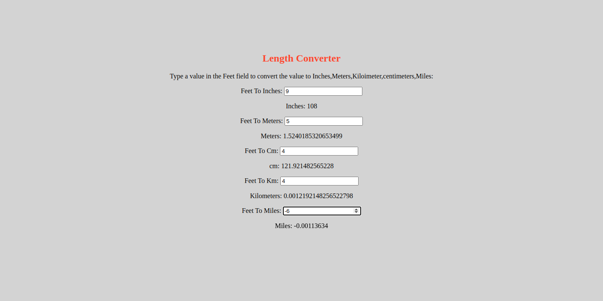

# lengthconverter

ATMs are (Automated Teller Machines) that are used to carry day-to-day financial transactions. ATMs can be used to withdraw money or to deposit money or even to know the information of an account like the balance amount, etc. They are convenient and easy to use,and  it allows consumers to perform quick self-service transactions.

   

   
